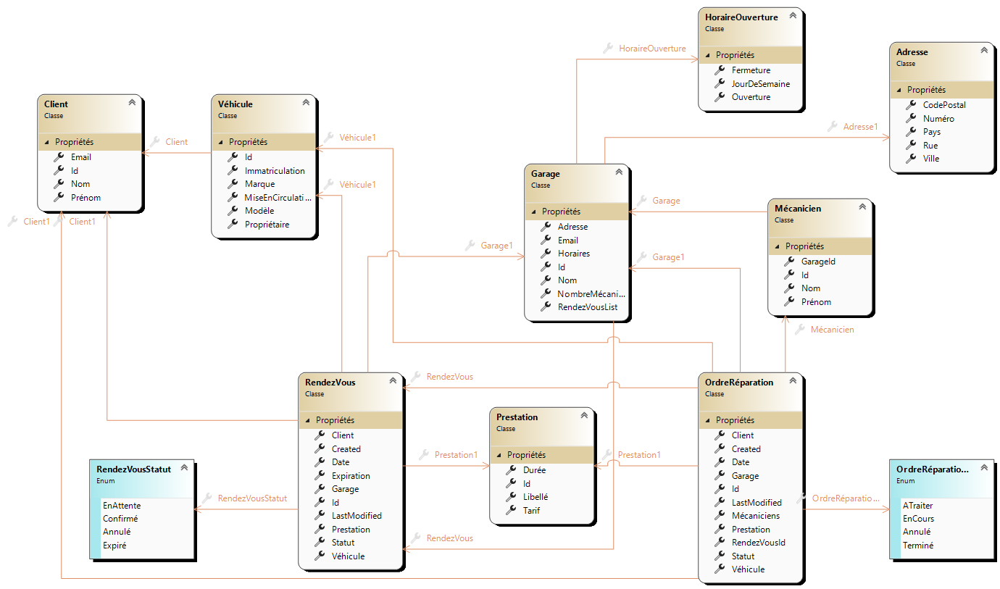

# SharpyGarage

📌 Qu'est ce que SharpyGarage

Un sample d'application d'un système de gestion pour garage automobile
Le but de ce sample est de démontrer plusieurs concepts d'architecture logicielle :
* Domain Driven Design (DDD)
* Anemic model to Rich model
* CQRS
*

🧰 Stack technique
* .NET 8 - C# 12

📋 Comment démarrer
* Installer .NET 8
* Compiler

💡 Sources d'inspiration
* https://github.com/EdwinVW/pitstop
* https://github.com/Defcon27/Autorizz-Car-Dealership-System-using-NodeJS-Express-MongoDB
* https://github.com/zowe/sample-node-api

## Diagramme de classes

